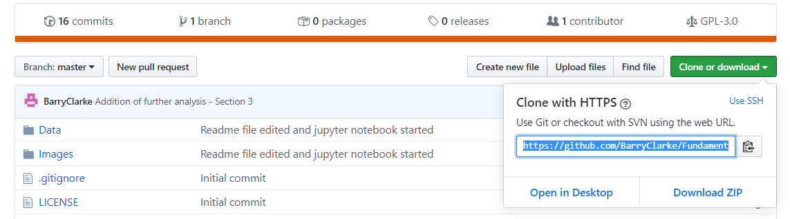

# Fundamentals-Assessment-2019

## scope
To describe and analyse of the Tips dataset. Fundamentals of data analysis module project 2019
[See here for instructions](https://github.com/ianmcloughlin/project-2019-fundda/raw/master/project.pdf)
## Table of Contents
1. Overview of Project
2. Description of the tips dataset
3. Regression of dataset to determine if a relationship between total bill and tip amount exists
4. Further analysis of the tips dataset

## Overview of project
The purpose of this project is to use jupyter notebook and the python seaborn package to describe and analyse the tips dataset. Jupyter is a python package used to present code and plots all in one browser environment, making it a very useful tool for presenting and sharing work in python. Seaborn is a Python data visualization library based on matplotlib. It provides a high-level interface for drawing attractive and informative statistical graphics [1]. The project consists of a jupyter notebook that uses descriptive statistics to describe the tips data set. A statistical method called regression is used to discuss and analyse if there is a relationship between two variables in the tips dataset (Total bill and Tip). Finally, the project analyses the dataset for other possible relationships among the data.

The main body of work in this assignment is performed in a jupyter notebook. As this notebook contains certain text formatting that is not loading into GitHub, nbviewer is the best location to open this file. To best explain and discuss the tips dataset, please follow the below link to a jupyter notebook viewer
[tips dataset jupyter notebook](https://nbviewer.jupyter.org/github/BarryClarke/Fundamentals---Assessment-2019/blob/master/Tips%20dataset.ipynb) 

To view the source code in jupyter notebook, please follow the below instructions:
1. In this repoistory (ie numpy.random-package) click on the clone or download button and copy the URL 
2. In cmder/command prompt on your system clone the repository using the command git clone followed by paste the URL
3. Go to the directory where you saved cloned the Repository
4. Type "jupyter notebook" for the repository to open in jupyter
5. When Jupyter notebook opens, click on the Tips dataset.ipynb file
6. In this file, locate the *Kernal* tab and select *Restart & Run All*  
**Note:** This assumes you have python and Github setup on your machine.

## Description of the dataset
The tips dataset is a well known dataset consisting of information recorded by a waiter about each tip received over a period of a few months working in one restaurant. This data consists of 7 variables (Total bill, Tip, Gender(Sex), Smoker(Y/N), Day, Time and Size (Party size)). This dataset has been used as a good basis to learn and understand statistics and analysis of data. The raw data collected for the tips dataset can be seen [here](/Data/tips.csv).

Firstly, the notebook looks at the use of the pandas package to present and analyse the data. Pandas offers very useful tools that can help manipulate and present the data in a meaningful manner. For instance, in the jupyter noetbook, two expressions of the data can be viewed through the use of the pandas and matplotlib packages. These tables and plots give the viewer a good general idea as to the relationship between the total bill and the tip in each record of the tips dataset. Using this, the analyst can make observations about the data. For example, generally speaking, the average tip varies bewteen 10% and 25%. Or, there is 1 outlier where the customer paid a tip of 70% of the total bill. These are all good starting points for analysing data 

A second package in Python that allows for descriptive statistical analysis is the Seaborn package. It is built on top of matplotlib and closely integrated with pandas. Used in conjunction with Matplotlib and pandas, Seaborn offers greater plotting options and styling, which can all improve the visuaization and understanding of the data. Typical uses of the seaborn package are used on the tips dataset in the notebook 

## Regression
Regression is a statistical method used to best fit a line to set of data points. In the notebook regression is performed and plotted in relation to total amoount and tip to best understand if a relationship exists between the two variables and how clear this relationship is.

## Further analysis
In Addition to the statistical summary and analyses of the relationship between the total bill and tip, the dataset is further examined and analysed using various pandas and seaborn functions to gain further insight other variables in the dataset

## References
[1]. https://seaborn.pydata.org/ - Introduction to the seaborn package 

In creating the jupyter notebook, the below references were used
1. https://jupyter.brynmawr.edu/services/public/dblank/Jupyter%20Notebook%20Users%20Manual.ipynb#2.4.2.2-Table-of-Contents-Support
2. https://stackoverflow.com/questions/332289/how-do-you-change-the-size-of-figures-drawn-with-matplotlib 
3. https://stackoverflow.com/questions/56095446/pandas-plot-bar-show-every-nth-xlabel
4. https://gist.github.com/makexu93/ceeadeec3fe691057fd64452bb969b43
5. https://towardsdatascience.com/analyze-the-data-through-data-visualization-using-seaborn-255e1cd3948e
6. https://seaborn.pydata.org/tutorial/regression.html#regression-tutorial
7. https://seaborn.pydata.org/generated/seaborn.boxplot.html#seaborn.boxplot
8. https://seaborn.pydata.org/generated/seaborn.violinplot.html
9. https://devarea.com/python-machine-learning-example-linear-regression/#.XdwgSej7Q2w

